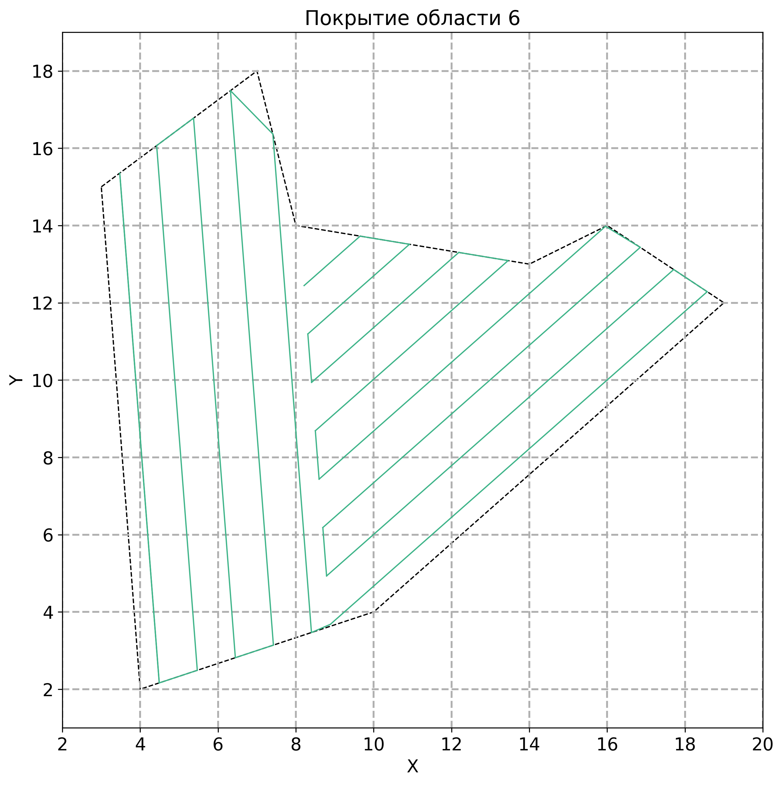

# Coverage Path Planning & Yaw Control

Алгоритм покрытия произвольной области и симуляция движения аппарата по построенному маршруту с моделью управления курсом.

Проект включает:
- построение галсов (coverage path);
- жадный выбор оптимального сегмента;
- последовательное связывание маршрута;
- модель динамики курса (передаточная функция);
- визуализацию движения.

---

## 📷 Examples

### Coverage path generation

<p align="center">
  
</p>

### Simulated vehicle motion

<p align="center">
  
</p>

---

## Dependencies

```bash
pip install numpy matplotlib shapely control
```

---

## Usage

```python
vertices = [(4, 11), (11, 7), (16, 12), (13, 16), (8, 17)]
gs = 1

points, ax = coverage_path_planning_algorithm(vertices, gs)
```

Optional motion simulation:

```python
yaw_model = YawControl()
controller = GoToPoint(
    position=[0, 0],
    speed=0.5,
    tolerance=0.1,
    transfer_function_model=yaw_model,
    plt=plt,
    debug=True
)

controller.start_mission(points[0])
```

---

## Structure

- `coverage_path_planning_algorithm` — построение маршрута покрытия  
- `Tack` — связный список галсов  
- `GoToPoint` — движение к waypoint  
- `YawControl` — модель управления курсом  

---

Проект демонстрирует базовую интеграцию алгоритма покрытия области и динамической модели управления движением.